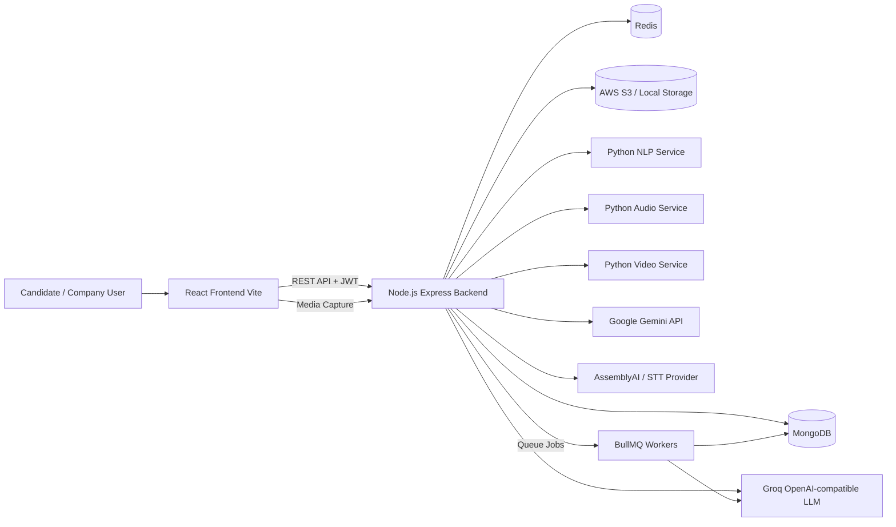

# HirePrep Weekend Assessment Preparation (50 Marks)

This guide is tailored to the current codebase so you can present confidently, answer viva questions, and make quick code changes during assessment.

## 1) Evaluation Rubric (10 marks each, total 50)

### 1. System Architecture (10/10)
- Explain layered architecture: frontend (React) -> backend API (Node/Express) -> data stores/services (MongoDB, Redis, S3) -> ML/analysis microservices (NLP, Audio, Video).
- Show clear separation of concerns across folders:
  - `frontend/src/*` for UI + service calls
  - `backend/src/routes/*` for API endpoints
  - `backend/src/controllers/*` for request orchestration
  - `backend/src/services/*` for business logic + AI/microservice integration
  - `backend/src/models/*` for schema/data modeling
  - `backend/nlp-service`, `backend/audio-service`, `backend/video-service` for Python processing services

### 2. Code Quality (10/10)
- Highlight middleware-driven quality gates:
  - Validation middleware in `backend/src/middlewares/validation.js`
  - Centralized error handling in `backend/src/middlewares/errorHandler.js`
  - Rate limits in `backend/src/middlewares/rateLimiter.js`
- Show modularity and readability:
  - Config modules in `backend/src/config/*`
  - Domain routes/controllers/services split

### 3. Scalability (10/10)
- Horizontal-ready backend and services via Docker Compose (`docker-compose.yml`).
- Redis-backed queue and rate limiting support:
  - BullMQ in `backend/src/services/queue.js`
  - Worker process in `backend/src/services/worker.js`
- Database tuning:
  - Mongo pool configuration in `backend/src/config/database.js`

### 4. Security (10/10)
- Request hardening in `backend/src/app.js`:
  - Helmet
  - `express-mongo-sanitize`
  - `xss-clean`
  - strict CORS policy with Vercel support
- JWT authentication and role authorization in `backend/src/middlewares/authMiddleware.js`.
- Secrets strategy:
  - AWS Secrets Manager option in `backend/server.js`

### 5. Data Management (10/10)
- Structured data modeling (User, Candidate, Job, Resume, Interview, Application).
- Document relationships via Mongo references (`ref`) for candidate-job-application linkage.
- Storage strategy:
  - Metadata in MongoDB
  - Documents/videos in S3 (or local fallback) via `backend/src/config/aws.js` and `backend/src/services/videoUploadService.js`.

---

## 2) Architecture Diagram

Presentation line:
- "HirePrep uses a hybrid microservice architecture: Node.js for orchestration, Python services for analysis, MongoDB for structured data, Redis for caching/queues, and S3 for binary assets."

---

## 3) Why These Technologies

### React (Frontend)
- Fast component-driven UI for multi-role portals.
- Centralized API abstraction in `frontend/src/services/*`.

### Node.js + Express (Backend API)
- High developer velocity and rich middleware ecosystem.
- Good fit for I/O-heavy workflows (uploads, service calls, AI APIs).

### MongoDB (Data)
- Flexible document model suits resumes/interview transcripts and nested analytics.
- Easy relation modeling with references for jobs/applications/users.

### Redis + BullMQ (Performance + Async)
- Queueing prevents long AI/NLP processing from blocking user requests.
- Enables retries, progress tracking, and background processing.

### Python Microservices (NLP/Audio/Video)
- Python ecosystem is strong for text/audio/video analysis libraries.
- Keeps CPU/ML-heavy tasks isolated from Node request lifecycle.

### AWS S3 (Object Storage)
- Durable and scalable storage for resumes, profile images, interview media.
- Signed URL and key-based lifecycle management patterns supported.

### LLM/AI APIs (Groq/Gemini)
- Dynamic interview question generation, response evaluation, feedback, and analysis.
- Fast model inference without maintaining self-hosted model infrastructure.

---

## 4) Data Flow (Explain in Viva)

## A. Authentication Flow
1. User registers/logs in from frontend.
2. Backend validates, issues JWT.
3. Frontend stores token and sends `Authorization: Bearer <token>`.
4. `authenticate` middleware verifies token and attaches user context.

## B. Resume Upload + Parsing Flow
1. Candidate uploads resume via frontend.
2. Backend uploads file to S3/local storage.
3. Resume metadata saved in MongoDB.
4. NLP service parses resume and extracts skills/education/experience.
5. Parsed structure + AI score persisted to `Resume` and candidate profile.

## C. Interview Analysis Flow
1. Candidate starts interview session.
2. Backend initializes interview context (Redis + Mongo fallback).
3. AI generates next question (Groq/Gemini-backed service).
4. Candidate submits answer + optional media data.
5. Audio and video analysis services compute behavioral metrics.
6. Combined scores and transcript are saved to interview/application records.
7. Final score and recommendation shown on dashboards and leaderboard.

## D. Company Evaluation Flow
1. Company posts jobs with requirements.
2. Candidates apply; applications linked to job + candidate.
3. AI-assisted scoring and interview analytics update ranking/readiness.
4. Company reviews results and moves candidates in workflow.

---

## 5) API Cost Calculation (Important for Guide)

Your guide asked for cost-as-per-use. Use this formula-driven method in presentation.

## A. Monthly AI Cost Formula

Let:
- $N_i$ = number of requests for feature $i$ per month
- $T_{in,i}$ = average input tokens/request
- $T_{out,i}$ = average output tokens/request
- $P_{in}$ = provider input price per 1M tokens
- $P_{out}$ = provider output price per 1M tokens

Then:

$$
\text{LLM Cost}_{month} = \sum_i N_i \times \left(\frac{T_{in,i}}{10^6}P_{in} + \frac{T_{out,i}}{10^6}P_{out}\right)
$$

For STT billed per minute:

$$
\text{STT Cost}_{month} = M \times P_{minute}
$$

where $M$ is total processed audio minutes.

Total AI monthly cost:

$$
\text{Total AI Cost} = \text{LLM Cost}_{month} + \text{STT Cost}_{month}
$$

## B. Features in This Project That Drive Cost
- AI question generation and answer evaluation:
  - `backend/src/services/geminiVoiceService.js`
  - `backend/src/services/aiInterviewService.js`
- STT transcription:
  - `backend/src/services/speechToTextService.js`
- Any Gemini API usage from:
  - `backend/src/config/gemini.js`
- Any Groq/OpenAI-compatible usage from:
  - `backend/src/config/openai.js`

## C. Practical Tracking Sheet Columns
- Feature name
- Endpoint
- Requests/day
- Avg input tokens
- Avg output tokens
- Avg audio minutes/request (if STT)
- Unit price
- Daily cost
- Monthly cost

Use 20% safety buffer:

$$
\text{Budgeted Cost} = 1.2 \times \text{Estimated Cost}
$$

## D. Sample Monthly AI Cost Table (Assumed Volumes)

Assumptions (example only, replace with your real usage):
- 30-day month
- 500 active candidates/month
- 300 completed AI interviews/month
- Pricing assumptions used for estimate:
  - Groq-compatible LLM: input $0.50 / 1M tokens, output $0.80 / 1M tokens
  - Gemini Flash: input $0.35 / 1M tokens, output $0.70 / 1M tokens
  - STT (AssemblyAI-style): $0.024 / audio minute

| Feature | API/Provider | Assumed volume | Avg payload | Est. monthly cost |
|---|---|---:|---:|---:|
| Interview question generation | Groq LLM | 300 interviews x 8 Q = 2,400 calls | 900 in + 120 out tokens/call | $1.27 |
| Per-answer evaluation | Groq LLM | 300 interviews x 8 answers = 2,400 calls | 1,300 in + 220 out tokens/call | $2.42 |
| Final interview summary | Groq LLM | 300 calls | 2,500 in + 500 out tokens/call | $0.50 |
| Resume AI feedback/enrichment | Gemini Flash | 500 resumes | 2,200 in + 350 out tokens/call | $0.51 |
| STT transcription for screening answers | STT provider | 300 interviews x 8 answers x 1.5 min = 3,600 min | 3,600 minutes/month | $86.40 |

Subtotal (AI + STT): $91.10/month

Budget with 20% safety:

$$
91.10 \times 1.2 = 109.32
$$

Recommended monthly AI budget target (sample): about $110/month.

Notes:
- In this architecture, STT is typically the largest cost driver.
- If average answer duration increases from 1.5 to 2.5 min, STT cost rises by about 66.7%.
- Cost optimization priority should be: reduce audio minutes, then reduce LLM token size.

---

## 6) Code-Level Readiness ("Know Each Line")

Be ready to explain these files first:
- Startup and middleware chain:
  - `backend/server.js`
  - `backend/src/app.js`
- Auth and security:
  - `backend/src/middlewares/authMiddleware.js`
  - `backend/src/middlewares/rateLimiter.js`
- Core business routes:
  - `backend/src/routes/resume.js`
  - `backend/src/routes/interview.js`
  - `backend/src/routes/geminiVoice.js`
  - `backend/src/routes/analysis.js`
- AI orchestration:
  - `backend/src/services/geminiVoiceService.js`
  - `backend/src/services/aiInterviewService.js`
- Data models:
  - `backend/src/models/Application.js`
  - `backend/src/models/Interview.js`
  - `backend/src/models/Resume.js`
  - `backend/src/models/Job.js`
  - `backend/src/models/Candidate.js`

---

## 7) Likely Viva Questions and Strong Answers

1. Why microservices here?
- "NLP/audio/video workloads have different dependencies and scaling patterns. Separating them keeps backend stable and allows independent scaling."

2. How do you prevent API abuse?
- "Rate limiting (global/auth/upload/AI), JWT-based auth, and role-based authorization."

3. What if Redis goes down?
- "System degrades gracefully with fallback paths for some operations; critical queue workloads are impacted but API remains available."

4. How do you secure uploads?
- "File type validation, size limits, private storage patterns, and controlled access routes."

5. How do you estimate AI cost?
- "Per-feature usage volume × token/minute pricing with monthly aggregation and safety buffer."

---

## 8) Weekend Presentation Checklist

- Prepare 5 slides mapped to the 5 criteria (10 marks each).
- Keep architecture diagram ready (Mermaid above can be rendered in Markdown preview).
- Keep one real API flow demo ready (login -> upload -> parse -> score).
- Keep one cost sheet with actual numbers from your usage logs.
- Be ready to open and modify at least one controller + one service file live.

If needed, convert this into a PPT script directly.

---

## 9) Have You Achieved All Assessment Points?

Short answer: mostly yes, but not fully 50/50 yet.

Current evidence-based score (project-ready estimate): 43/50.

### 1. System Architecture (9/10)
Achieved:
- Clear modular architecture across frontend, backend, data, and Python services.
- Deployment composition exists in [docker-compose.yml](docker-compose.yml).

Small gap to full marks:
- Keep one finalized architecture image exported (PNG/PDF) in repo for assessor-ready presentation.

### 2. Code Quality (8/10)
Achieved:
- Good separation of routes/controllers/services/models.
- Middleware and config organization is strong.

Gap:
- Role naming inconsistency can cause bugs during authorization:
  - [backend/src/middlewares/authMiddleware.js](backend/src/middlewares/authMiddleware.js)
  - [backend/src/routes/interview.js](backend/src/routes/interview.js)
  - [backend/src/routes/upload.js](backend/src/routes/upload.js)
  - [frontend/src/App.jsx](frontend/src/App.jsx)

### 3. Scalability (8/10)
Achieved:
- Redis-backed queues/rate-limits and worker model are present.
- Microservice split supports independent scaling.

Gap:
- Some worker pipelines still contain placeholder logic/comments and need full production implementation:
  - [backend/src/services/worker.js](backend/src/services/worker.js)

### 4. Security (9/10)
Achieved:
- Helmet, sanitize, xss-clean, JWT auth, role checks, and rate limits.
- Optional AWS Secrets integration in startup path.

Gap:
- Tighten upload and route-level policy consistency (same role vocabulary everywhere) and add a documented security test checklist.

### 5. Data Management (9/10)
Achieved:
- Strong data modeling for application/interview/resume lifecycle.
- S3 + metadata pattern and fallback strategy are in place.

Gap:
- Add a data retention/deletion policy doc (especially interview media and analytics lifespan) for full governance marks.

## What You Already Have from Guide Requirements
- Architecture diagram: yes (section 2)
- Reason for particular technology: yes (section 3)
- Data flow: yes (section 4)
- API cost model + sample monthly table: yes (section 5)

Final readiness statement:
- You have covered all required assessment topics.
- With 3 focused improvements (role consistency, worker completion, retention policy doc), you can target full 50/50.